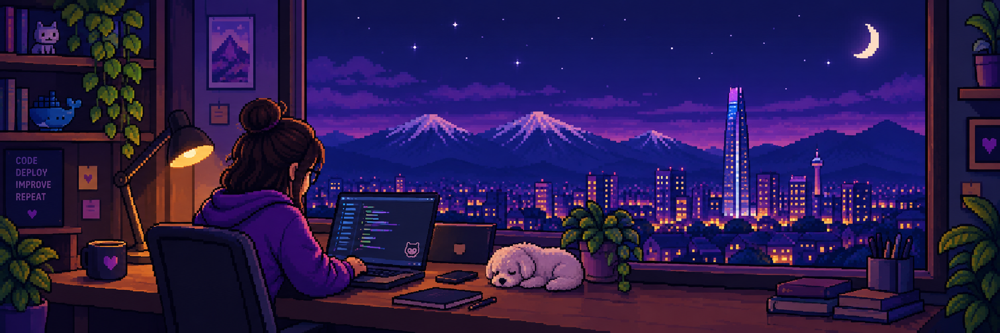

# CAMILA MARÍN

### Backend Engineer · DevOps · AI Engineering

Construyo sistemas backend, automatizo su despliegue, y estoy llevando
esa base hacia productos con IA aplicada.

 

## 📊 Sobre mí

- 💻 Ingeniera Civil en Informática, 8+ años construyendo sistemas
  backend, APIs, integraciones y automatización
- 🐍 Python (FastAPI, Flask, Django) · Go · Node.js
- ☁️ DevOps & Cloud — AWS, Docker, Terraform, Ansible, CI/CD
  (GitHub Actions, GitLab CI, Jenkins)
- 🧩 Experiencia real en instituciones académicas, organismos públicos
  y empresas privadas — no solo proyectos personales
- 🤖 Profundizando en AI Engineering: aplicaciones prácticas de IA,
  flujos agénticos, y herramientas que mejoran cómo se construye
  software
- 🌐 Inglés intermedio, orientado a lectura de documentación técnica y
  material especializado
- 📍 Chile · Abierta a oportunidades remotas

## 🧰 Cómo trabajo

- 📐 **Spec-driven**: escribo requisitos y diseño antes de implementar,
  aplicado de forma consistente en cada proyecto de mi portafolio
- 🔄 **Automatización**: prefiero un proceso repetible a uno manual,
  desde CI/CD hasta scripts de deploy
- 🧪 **Testing como parte del desarrollo**, no como una etapa aparte
- 🔐 **Privacidad desde el diseño**: en mis proyectos personales, evito
  recolectar datos que no necesito
- 🤝 **Coordinación en equipos multidisciplinarios**, en entornos ágiles
  — experiencia real de mis años en CITIAPS, no solo trabajo individual

## 📂 Proyectos destacados

### 📚 [EntreLíneas](https://github.com/camilamarin/entrelineas)
Plataforma para clubes de lectura con funcionalidades impulsadas por
IA — gestión de libros, grupos de lectura, recomendaciones.

`Python` `FastAPI` `PostgreSQL` `Docker`

**Estado:** en despliegue (Render + Neon) — demo próximamente

### 🎧 [FocusRoom](https://github.com/camilamarin/focusroom)
PWA minimalista para sesiones de concentración: temporizador, sonido
ambiental generado con Web Audio API, y estadísticas locales.

`React` `TypeScript` `PWA` `Web Audio API`

**Estado:** construido · [Ver demo ↗](https://camilamarin.github.io/focusroom)

### 🔧 BlackPhone
Plataforma de gestión para talleres de reparación electrónica —
órdenes de reparación, clientes, dispositivos, seguimiento de estados e
historial técnico.

`Python` `FastAPI` `PostgreSQL` `JWT` `Docker`

**Proyecto privado para un cliente real** — código no
público por acuerdo de confidencialidad.

## 🧩 Stack técnico

**Backend**

**APIs e integración**

**Bases de datos**

**Cloud & DevOps**

**Frontend (proyectos personales)**

**AI & Tools**

## 📈 GitHub Stats

## 🕓 Actividad reciente

<!--START_SECTION:activity-->
<!-- Esta sección se actualiza sola con la GitHub Action del workflow -->
<!--END_SECTION:activity-->

## 💜 Conectemos

Siempre abierta a conversar sobre tecnología, colaboraciones y nuevas
oportunidades.

 

"Código es escribir para las máquinas. Buen software es escribir para las personas." 💜

